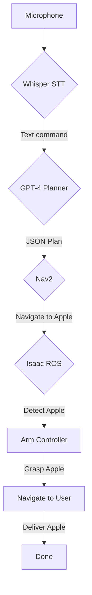

# Week 13 - Capstone: The Autonomous Humanoid

## 1. Scenario
You are tasked with building the software for a humanoid robot in a kitchen environment. The user will give a voice command, and the robot must execute the task.

**User Command:** "Bring me the red apple."

## 2. Architecture Diagram
This project integrates all the modules from this course.

## 3. Rubric
Your grade will be based on the following criteria:

* **30%: Successful Navigation:** The robot must navigate to the apple's location without colliding with any obstacles.
* **30%: Correct Object Detection:** The robot must correctly identify the red apple from other objects on the table using a trained object detection model (e.g., YOLOv8).
* **40%: Successful Grasping & Retrieval:** The robot must successfully pick up the apple and bring it back to the user's starting location.

## 4. Submission
* **GitHub Repository:** Your submission must be a public GitHub repository containing all your code, launch files, and a detailed `README.md`.
* **Screen Recording:** A 90-second video demonstrating your robot completing the task in the simulator.
